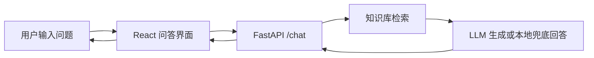

# 系统架构

<!-- 作用：说明项目整体架构、核心模块边界和前后端调用链，便于组长管理实现范围。 -->

## 架构目标

系统采用前后端分离架构。前端负责 PC 与移动端问答体验，后端负责问题理解、知识检索、LLM 生成和结果结构化输出。

## 调用链路



## 后端模块

- `app.main`：创建 FastAPI 应用，挂载 CORS 和 API 路由。
- `app.core.config`：集中读取环境变量。
- `app.api.routes.health`：健康检查接口。
- `app.api.routes.qa`：智能问答接口。
- `app.services.knowledge_base`：加载并检索三资管理知识库。
- `app.services.llm_service`：封装 LLM 调用，并提供无 Key 兜底回答。

## 前端模块

- `src/App.tsx`：应用主布局，组合问答页面。
- `src/components`：拆分头部、聊天区、资料来源等组件。
- `src/hooks/useChat.ts`：管理消息状态和问答请求。
- `src/api/client.ts`：统一封装后端 API 调用。
- `src/styles/global.css`：PC 与移动端响应式样式。

## 数据契约

前端调用：

```http
POST /chat
```

请求字段：

- `question`：用户问题，必填。
- `platform`：`pc` 或 `mobile`。
- `session_id`：会话标识，可选。

返回字段：

- `answer`：简明化回答。
- `sources`：引用的知识材料。
- `suggestions`：推荐追问。
- `trace_id`：排查问题用的链路 ID。

兼容说明：后端仍保留 `POST /api/qa/ask`，但前端主链路统一调用 `POST /chat`。
